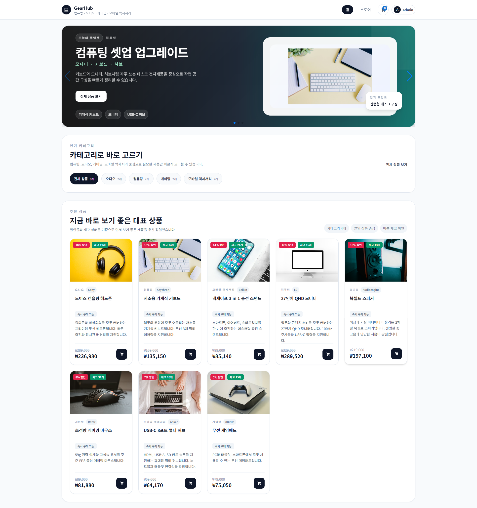
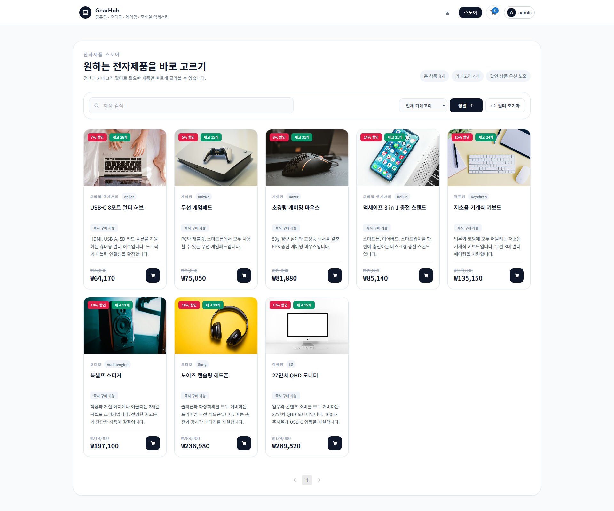
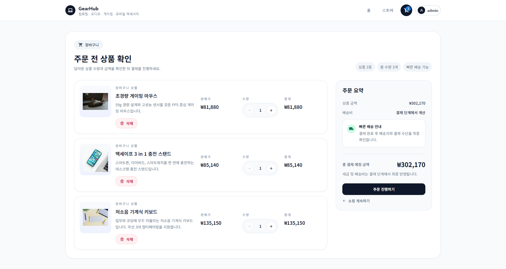
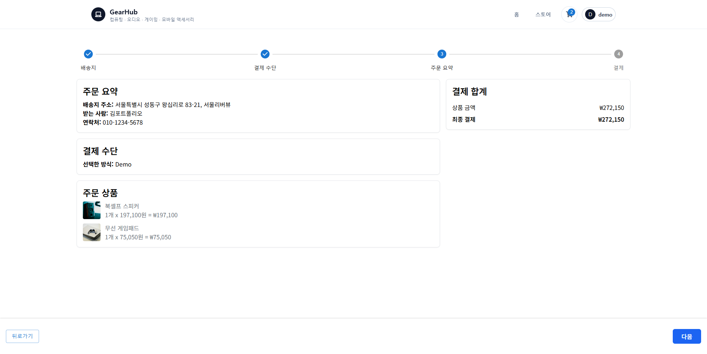
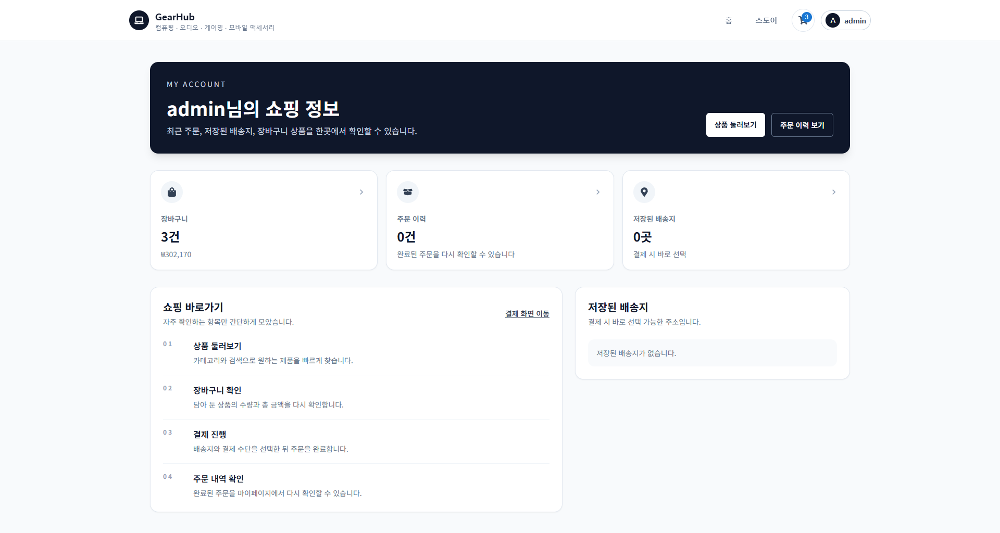
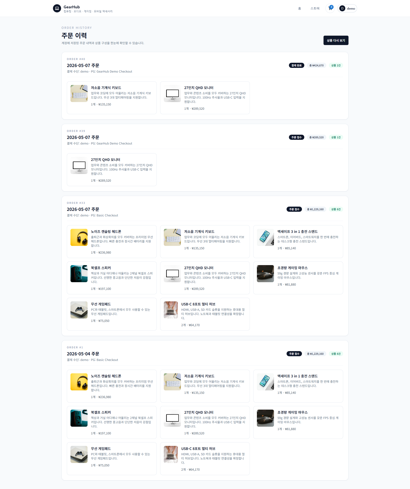
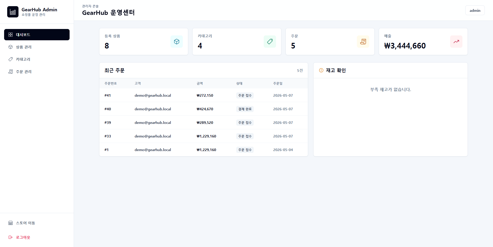
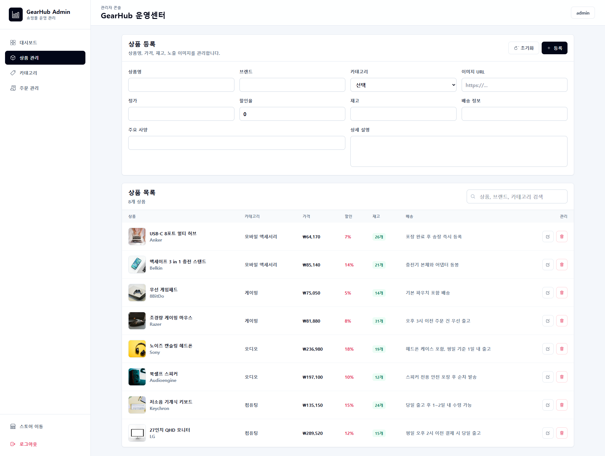
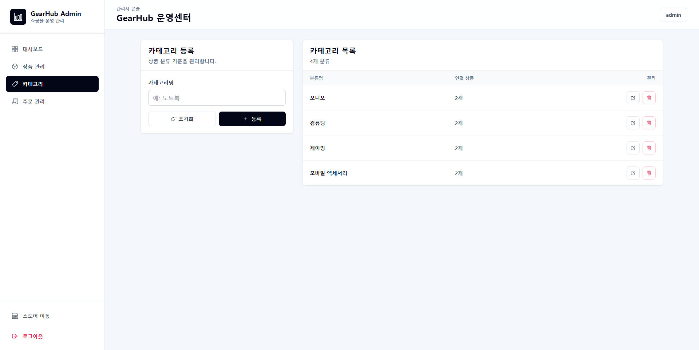
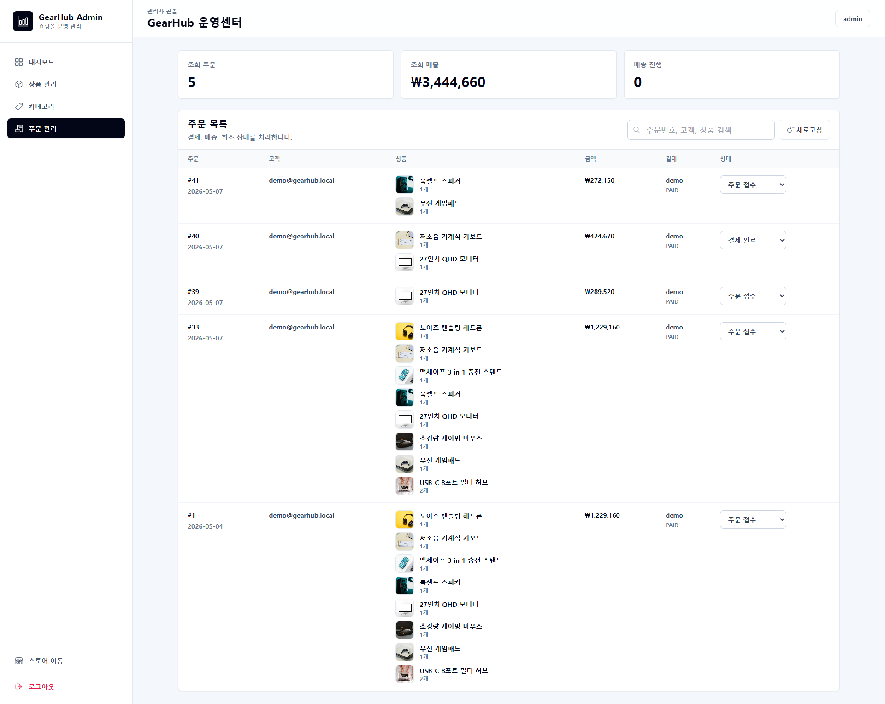

# GearHub 이커머스 프론트엔드

GearHub는 컴퓨팅, 오디오, 게이밍, 모바일 액세서리 중심의 전자제품 전문 이커머스 쇼핑몰입니다. 이 저장소는 React + Vite 기반 프론트엔드이며, 일반 사용자 쇼핑몰 화면과 관리자 운영 콘솔을 하나의 프론트 애플리케이션 안에서 라우트 모듈로 분리해 구성했습니다.

핵심은 `shop / admin / components / store / api`로 역할을 나누고, JWT 인증 상태를 기반으로 상품 탐색, 장바구니, 배송지, 주문, 주문 내역, 관리자 상품/카테고리/주문 관리 흐름을 Spring Boot API와 연결한 점입니다.

## 프로젝트 개요

- 전자제품 전용 쇼핑몰 홈 화면
- 상품 목록, 필터, 정렬, 상세 조회
- 장바구니 담기, 수량 변경, 삭제
- 회원가입 및 로그인
- 배송지 등록/선택과 주문 진행
- 데모 결제 기반 주문 생성
- 사용자 마이페이지 및 주문 내역 조회
- 관리자 전용 대시보드
- 관리자 상품/카테고리/주문 관리
- 사용자 화면과 관리자 화면의 라우트 모듈 분리

## 이 저장소가 맡는 역할

GearHub 서비스는 프론트엔드와 백엔드가 분리된 구조입니다.

- 사용자 화면: 쇼핑몰 홈, 상품 목록, 상세, 장바구니, 체크아웃, 마이페이지
- 관리자 화면: 운영 대시보드, 상품 관리, 카테고리 관리, 주문 관리
- 상태 관리: Redux 기반 인증, 장바구니, 상품, 결제 수단 상태 관리
- API 통신: Axios 인스턴스와 JWT Authorization 헤더 자동 주입
- UI 구성: Tailwind CSS, MUI, React Icons 기반 반응형 인터페이스

이 저장소는 백엔드 API를 소비하는 클라이언트 역할을 맡습니다. 사용자단과 관리자단을 `src/modules/shop`, `src/modules/admin`으로 분리해서 포트폴리오에서 서비스 구조가 명확하게 보이도록 구성했습니다.

## 핵심 서비스 흐름

1. 사용자는 홈 또는 스토어 화면에서 전자제품을 탐색합니다.
2. 상품 카드를 클릭하면 상세 페이지로 이동하고, 장바구니 버튼으로 상품을 담습니다.
3. 장바구니에서 수량과 결제 예정 금액을 확인한 뒤 체크아웃으로 이동합니다.
4. 배송지를 선택하고 결제 수단을 고른 다음 주문 요약을 확인합니다.
5. 데모 결제에서는 실제 결제 승인 없이 서버 장바구니를 동기화한 뒤 주문을 생성합니다.
6. 주문 완료 후 마이페이지의 주문 내역에서 주문 상태와 상품 구성을 확인합니다.
7. 관리자 계정은 `/admin`으로 진입해 전체 상품, 카테고리, 주문 상태를 운영합니다.

## 화면 구성

### 사용자 화면

| 메인 | 스토어 |
| --- | --- |
|  |  |

| 장바구니 | 주문 완료 |
| --- | --- |
|  |  |

| 마이페이지 | 주문 내역 |
| --- | --- |
|  |  |

### 관리자 화면

| 관리자 대시보드 | 상품 관리 |
| --- | --- |
|  |  |

| 카테고리 관리 | 주문 관리 |
| --- | --- |
|  |  |

## 주요 기능

### 1. 사용자 쇼핑몰

- 메인 배너와 추천 상품 노출
- 카테고리 기반 상품 탐색
- 가격 정렬 및 상품 검색
- 상품 상세 페이지 이동
- 상품 이미지, 브랜드, 사양, 배송 정보 표시

관련 모듈:

- `src/modules/shop/ShopRoutes.jsx`
- `src/components/home`
- `src/components/products`

주요 경로:

- `/`
- `/products`
- `/products/:productId`

### 2. 장바구니

- 상품 담기
- 상품 수량 증가/감소
- 상품 삭제
- 로컬 장바구니 상태 유지
- 주문 직전 서버 장바구니 동기화

관련 모듈:

- `src/components/cart`
- `src/store/reducers/cartReducer.js`
- `src/store/actions/index.js`

주요 경로:

- `/cart`

### 3. 인증 및 사용자 계정

- 회원가입
- 로그인
- JWT 인증 정보 로컬 저장
- 로그인 사용자 배송지/장바구니 자동 조회
- 사용자 메뉴와 관리자 메뉴 조건부 노출

관련 모듈:

- `src/components/auth`
- `src/components/UserMenu.jsx`
- `src/components/PrivateRoute.jsx`

주요 경로:

- `/login`
- `/register`
- `/account`
- `/account/orders`

### 4. 체크아웃 및 주문

- 배송지 선택
- 결제 수단 선택
- 주문 요약
- 데모 결제 주문 생성
- 주문 완료 후 주문 내역 이동

관련 모듈:

- `src/components/checkout`
- `src/store/actions/index.js`

주요 경로:

- `/checkout`

### 5. 관리자 콘솔

- 관리자 대시보드
- 전체 상품 수, 카테고리 수, 주문 수, 매출 요약
- 상품 등록/수정/삭제
- 카테고리 등록/수정/삭제
- 주문 목록 조회
- 주문 상태 변경
- 관리자 전용 라우트 보호

관련 모듈:

- `src/modules/admin/AdminRoutes.jsx`
- `src/modules/admin/components/AdminLayout.jsx`
- `src/modules/admin/pages/AdminDashboard.jsx`
- `src/modules/admin/pages/AdminProducts.jsx`
- `src/modules/admin/pages/AdminCategories.jsx`
- `src/modules/admin/pages/AdminOrders.jsx`

주요 경로:

- `/admin`
- `/admin/products`
- `/admin/categories`
- `/admin/orders`

## 기술 스택

### Frontend


### API 연동


## 프로젝트 구조

```text
src/
├── api/                         # Axios 인스턴스, JWT 헤더 주입
├── assets/                      # 정적 에셋
├── components/
│   ├── account/                 # 마이페이지, 주문 내역
│   ├── auth/                    # 로그인, 회원가입
│   ├── cart/                    # 장바구니
│   ├── checkout/                # 배송지, 결제 수단, 주문 요약
│   ├── home/                    # 홈 화면, 배너
│   ├── products/                # 상품 목록, 필터, 상세
│   └── shared/                  # 공통 UI
├── hooks/                       # 상품 필터 훅
├── modules/
│   ├── admin/                   # 관리자 라우트와 화면
│   └── shop/                    # 사용자 쇼핑몰 라우트
├── store/                       # Redux store, reducer, action
└── utils/                       # 가격 포맷, 텍스트 유틸
```

## 모듈별 역할

### `src/modules/shop`

- 사용자 쇼핑몰 라우트 집약
- 홈, 상품, 상세, 장바구니, 체크아웃, 계정 페이지 연결
- 공개 페이지와 로그인 필요 페이지 분리

### `src/modules/admin`

- 관리자 전용 라우트 집약
- `ROLE_ADMIN` 계정만 접근 가능
- 대시보드, 상품 관리, 카테고리 관리, 주문 관리 화면 구성

### `src/store`

- 인증 사용자 정보
- 장바구니 상품 및 합계
- 상품 목록과 카테고리
- 결제 수단
- 로딩 및 오류 상태

### `src/api`

- 백엔드 API 기본 주소 관리
- `localStorage.auth.jwtToken`을 Authorization 헤더로 자동 주입
- 쿠키 기반 인증 흐름을 위해 `withCredentials` 사용

## 실행 준비

### 프론트엔드 실행

```bash
npm install
npm run dev
```

PowerShell:

```powershell
npm install
npm run dev
```

### 빌드

```bash
npm run build
```

### 미리보기

```bash
npm run preview
```

## 주요 환경 변수

| 변수 | 설명 |
| --- | --- |
| `VITE_BACK_END_URL` | Spring Boot API 서버 주소 |
| `VITE_FRONTEND_URL` | 프론트엔드 실행 주소 |

예시:

```env
VITE_BACK_END_URL=http://localhost:8080
VITE_FRONTEND_URL=http://localhost:5173
```

## 데모 계정

| 역할 | 아이디 | 비밀번호 |
| --- | --- | --- |
| 일반 사용자 | `demo` | `password123!` |
| 관리자 | `admin` | `admin1234!` |

## 보완한 부분

- 전자제품 전문 쇼핑몰 콘셉트로 UI와 문구 정리
- 상품 카드 클릭 시 상세 페이지 이동
- 장바구니 버튼을 아이콘 중심으로 정리
- 상품 상세 페이지 및 관련 상품 영역 추가
- 로그인/회원가입 화면 단일 카드형 레이아웃 정리
- 상품 이미지 영역 비율 보정
- 관리자 전용 라우트와 운영 콘솔 추가
- 상품/카테고리/주문 관리 화면 추가
- 공개 회원가입과 관리자 권한 화면 분리
- 주문 완료 직전 서버 장바구니 동기화 처리
- 장바구니 동기화 반복 요청 제거
- README 한글 문서화 정리

## 관련 저장소

- Frontend: [Gearhub_react](https://github.com/xowlsakffl/Gearhub_react)
- Backend: [Gearhub_springboot](https://github.com/xowlsakffl/Gearhub_springboot)
